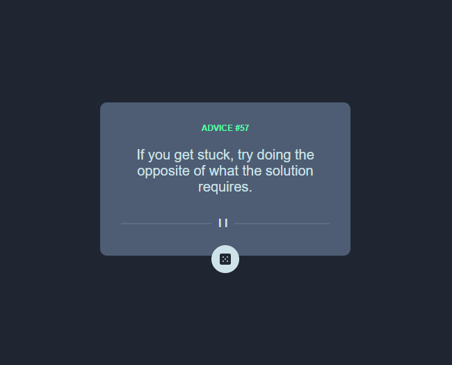

# Frontend Mentor - Advice generator app solution

This is a solution to the [Advice generator app challenge on Frontend Mentor](https://www.frontendmentor.io/challenges/advice-generator-app-QdUG-13db). Frontend Mentor challenges help you improve your coding skills by building realistic projects.

## Table of contents

- [Overview](#overview)
  - [The challenge](#the-challenge)
  - [Screenshot](#screenshot)
  - [Links](#links)
  - [Built with](#built-with)
  - [Useful resources](#useful-resources)
- [Author](#author)

## Overview

### The challenge

Users should be able to:

- View the optimal layout based on the device's screen size
- See hover states for the interactive elements
- Generate a new random quote by clicking the dice icon

### Screenshot

### Links

- Solution URL: [Add solution URL here](https://github.com/willoak/gerador-de-conselhos)
- Live Site URL: [Add live site URL here](https://willoak.github.io/gerador-de-conselhos/)

### Built with

- HTML5
- CSS custom properties
- Flexbox
- Javascript

## Author

- Website - [Willian Carvalho](https://www.wicarvalho.com)
